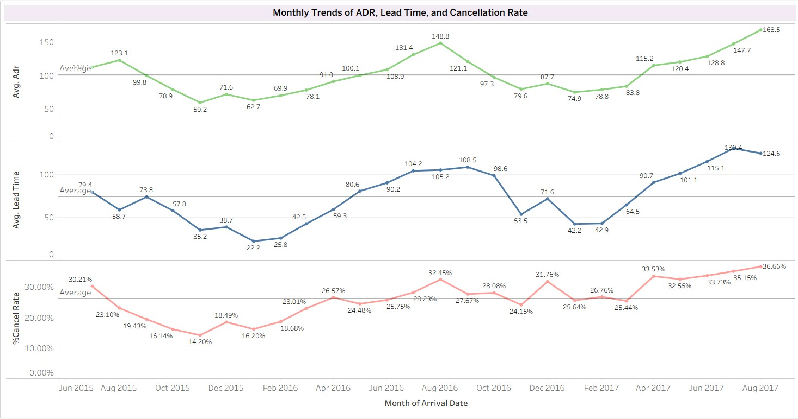

# DS512-513
# Analyzing Factors Influencing Hotel Booking Cancellations to Enhance Sales Strategy

## Data Source  
Kaggle Notebook: “EDA of bookings and ML to predict cancelations”  
Source link: https://www.kaggle.com/code/marcuswingen/eda-of-bookings-and-ml-to-predict-cancelations
This dataset contains 119390 observations for a City Hotel and a Resort Hotel. Each observation represents a hotel booking between the 1st of July 2015 and 31st of August 2017, including booking that effectively arrived and booking that were canceled.

- **Total Rows:** 119,390 records  
- **Total Columns:** 32 features  

## Overview
   The hotel industry is rapidly transforming as digital platforms make booking easier and more convenient for guests. While this brings new opportunities, it also creates challenges, especially for hotels that want to reduce reliance on third-party platforms and manage bookings more efficiently. 

   One major issue is the rising rate of booking cancellations, which impacts revenue and room planning. This project analyzes hotel booking data to uncover the key factors driving cancellations and provide insights that help hotels improve forecasting, operations, and profitability.
   
---
## Problem Statement
From the dataset hotel cancellations have increased and now impact revenue and room planning. Analyzing the factors behind these cancellations helps hotels improve forecasting and manage operations more effectively.

---
## Key Questions
 1. Which countries have the highest and lowest cancellation rates among the Top 10 booking countries?
 2. How do customer type, market segment, deposit type, and distribution channel influence the likelihood of booking cancellations, and which groups exhibit the  highest cancellation risk?
 3. Which features (lead time, ADR,etc.) show the positive relationship with cancellation?
   - Does longer lead time significantly increase the likelihood of cancellation?
   - Are price-sensitive customers (high ADR or discounts) more likely to cancel?
     
                                  The chart shows the revenue impact caused by booking cancellations.
     

---
## Value Propositions
   Our analysis identifies the key factors that most strongly influence booking cancellations, such as lead time and ADR, enabling hotel owners to optimize revenue planning, allocate staff efficiently, and reduce operational uncertainty.

---
## Data Dictionary

---
# Exploratory Data Analysis (EDA)
---
## Data Cleaning & Preparation
- Remove:
     - Duplicate records
     - Rows with missing / NULL values (where appropriate)
     - Outliers (extreme ADR values)
- Adjust column types to appropriate dtypes (e.g., dates, integers, categories).
- Result after cleaning:
     - **87,108 rows**
     - **30 columns**

---
# Data Analysis & Key Findings

---
**1. Which countries have the highest and lowest cancellation rates among the Top 10 booking countries?**

Visualization:
1. Map of top booking countries
2. Stacked bar chart: Canceled vs Not Canceled for Top 10 countries

**Key Findings:**
1. Brazil, Italy, and Portugal show the highest cancellation ratios (≥30%).
2. High booking volume ≠ high cancellation rate.
3. Countries like France, UK, Germany have high total bookings but lower cancellation percentages (<20%).
4. Western Europe remains the hotel’s core market, but targeted strategies may be required for countries with unstable booking behavior.
5. Countries with high cancellation propensity should be flagged as High-Risk Market Segments for more controlled booking policies.

**Summarize:**
Brazil, Portugal and Italy show the highest cancellation rates despite high booking volumes, while Germany, the UK, and the Netherlands remain the most stable markets.

---
**2. How do customer type, market segment, deposit type, and distribution channel influence the likelihood of booking cancellations, and which groups exhibit the highest cancellation risk?**

Visualization: Stacked bar shows cancellation distribution across customer type, market segment, deposit type, and distribution channel, divided into Canceled and Not Canceled bookings.

These four features were selected because they reflect booking behavior and conditions that the hotel can directly control. They also show the clearest differences in cancellation patterns and can be practically translated into policy actions. Hotels can adjust deposit policies, refine channel strategies, and design targeted offers for Online Travel Agencies and Transient customers, resulting in high business impact.

**Key Findings:**
1. Customer Type: Transient customers have the highest cancellation rate (≈30%).
2. Market Segment: Online TA (Online Travel Agencies) shows the highest cancellation rate (≈35%).
3. Deposit Type:No-Refund bookings have extremely high cancellation rates (≈95%).
(However, this group represents a relatively small sample size (approximately 1,000 bookings), and the hotel does not directly lose room revenue from these cancellations. Nevertheless, further investigation is warranted, as cancellations in this segment may still result in indirect revenue losses from ancillary services and on-property spending.)
4. Distribution Channel:TA/TO (Travel Agents / Tour Operators) shows high cancellation rates (≈30%).

**Summarize:**
- The riskiest segments in terms of cancellations are: Online TA, TA/TO, and Transient customers.
- Deposit type shows atypical behavior in this dataset, with Non-Refundable bookings exhibiting unusually high cancellation rates, suggesting dataset-specific patterns that warrant further investigation.

---
**3.Which features (lead time, ADR etc.) show the strongest relationship with cancellation?**

Visualization: Pearson correlation table 

**Key Findings:** 
 The correlation coefficients indicate no relationship between the features and booking cancellations. Most relevant features associated with cancellation are
   1. Lead Time
   2. ADR
   3. Stay in week night

Arrival Year was excluded from the analysis due to significant data imbalance. Since only the year 2016 contains complete observations, including this feature would introduce bias and reduce the validity of the results.
      
**Summarize:**
Lead time and ADR are the most influential positive predictors of cancellation in this dataset

---
**4. Does longer lead time significantly increase the likelihood of cancellation?**

Visualization: Histogram + Boxplot comparing Lead Time for Canceled vs Not Canceled bookings.

**Key Findings:**
1. Canceled bookings have substantially higher Lead Time compared to non-canceled bookings.
2. The median Lead Time for canceled bookings is around 55–60 days, which is higher than the median for non-canceled bookings (approximately 35–40 days).
3. Guests who book far in advance tend to cancel more frequently.
4. Long lead times may indicate uncertainty or flexible travel plans, increasing likelihood of cancellation.

**Summarize:**
Guests who book far in advance tend to cancel more frequently.

---
**5.Are price-sensitive customers (high ADR or discounts) more likely to cancel?**

Visualization: 
1. Bar chart showing average ADR for each cancellation group
2. Boxplot + histogram for ADR distribution

**Key Findings:**
1. Canceled bookings have ~18% higher ADR.
2. High-value bookings (ADR > 400) appear mostly in the canceled group.
3. The median ADR levels are broadly comparable between canceled and non-canceled bookings.
4. Some high-value bookings are more likely to be canceled.

**Summarize:**
Higher ADR bookings show a higher cancellation tendency, with canceled reservations having ~18% higher ADR on average and a wider distribution, indicating high-priced bookings are more likely to be canceled.

---
**6. Does longer stay increase cancellation rate?**

Visualization:
1.Boxplot comparing week-night stays 
2.Histogram of stay durations

**Key Findings:**
1. Canceled bookings also peak around 1–4 nights, similar to non-canceled.However, the distribution shows more bookings in higher night counts (5–7 nights) compared to non-canceled.
2. Medians are similar for both groups, but overall, cancellation likelihood increases as week-night stays increase.
3. Long-stay bookings exhibit higher risk.

**Summarize:**
Cancellation rates rise as week-night stays increase. Long-stay bookings show the highest cancellation risk, while short stays remain more stable.

---
**7. Does seasonality have a significant impact on booking cancellations?**

Visualization:
1. Graph shows  Monthly Trends of ADR, Lead Time, and Cancellation Rate
2. Line chart with forecast shading : Shows upward trend of cancellations.

**Key Findings:**
1. ADR rises seasonally, especially in mid-year, indicating stronger booking demand.
2. Cancellations show a clear upward trend throughout 2018.
3. Cancellation rates start rising in March–May and highest levels in July–August every year,athough Portugal’s tourist high season = June–August, cancellations peak before the actual travel period.
4. The increase in cancellation rates is predominantly seasonal, as seasonality explains the majority of the forecast variance, while the long-term trend plays a secondary role.
5. Hotels should adjust deposit or lead-time policies in high-risk months.

## **Summarize**
1. ADR, lead time, and cancellation rates follow similar seasonal patterns, rising around the mid-year months and indicating that longer advance bookings carry higher cancellation risk during this period.
2. The hotel should consider implementing deposit requirements or adjusting lead time policies specifically during June–August  to reduce revenue loss risk.

---
## **Summarize**

**Key behavioral patterns identified:**
1. It was found that as the lead time increases, the likelihood of a booking being canceled also rises.
2. A higher Average Daily Rate (ADR) also tends to increase the chance that customers will cancel their reservations.
3. Countries with the highest cancellation rates include Italy, Brazil, and Portugal.
4. Online Travel Agencies, non-refundable bookings and TA/TO have the highest cancellation risks.
5. Seasonal patterns show cancellation clusters during March–May and peak during July–August, showing a clear seasonal pattern where guests typically cancel 1–3 months before the high tourism season.
6. Long-stay reservations are disproportionately represented among canceled bookings.

---
## **Recommendation/Action**

1. Reduce the maximum advance booking period to no more than 360 days (from two years to one year).
2. Adjust booking strategies by requiring deposit at the time of reservation or shortening the payment deadline, especially for high-risk segments such as OTA bookings, long lead-time reservations, high-ADR bookings, and guests from countries with historically high cancellation rates.
3. Provide flexible pricing or perks for high-ADR bookings to reduce price sensitivity.
4. Apply stricter cancellation or deposit policies to countries with historically high cancellation rates.
5. Negotiate terms with OTAs for stricter cancellation rules.
6. Offer direct-booking benefits to shift customers from OTA channels.
7. Require partial prepayment for reservations > 7 nights.
8. Provide stay packages or discounts to lock in longer stays.
9. March–August is a critical risk window for revenue loss.
    - Shortening payment deadlines
    - Implementing stricter deposit requirements
    - Offering price incentives to secure bookings earlier
11. Improve customer communication by implementing automated reminders and pre-stay confirmations.
12. Develop a machine learning model to predict booking cancellations.

---
## **Impact**
1. Reduces revenue loss from customers who cancel "early-booked rooms."
2. Increases retention among high-value bookings.
3. Reduction in cancellations from markets with unstable booking behavior.
4. Lower cancellations from the highest-risk booking channel.
5. Protects potential revenue lost from canceled long-duration stays.
6. Reduce unintentional cancellations and decrease the incidence of no-shows
